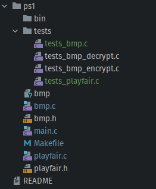

# ps1-tests

add file 
```
tests_bmp.c
```
and
```
tests_playfair.c
```
to directory 
```
tests
```

### Example Structrue


### Makefile
Add following code to makefile
```
test_playfair: playfair.o tests/tests_playfair.c
	$(CC) $(CFLAGS) $(LDLIBS) playfair.c tests/tests_playfair.c -o bin/test_playfair.o
	./bin/test_playfair.o
test_bmp: bmp.o tests/tests_bmp.c
	$(CC) $(CFLAGS) $(LDLIBS) bmp.c tests/tests_bmp.c -o bin/test_bmp.o
	./bin/test_bmp.o
```
which will run the tests

  
